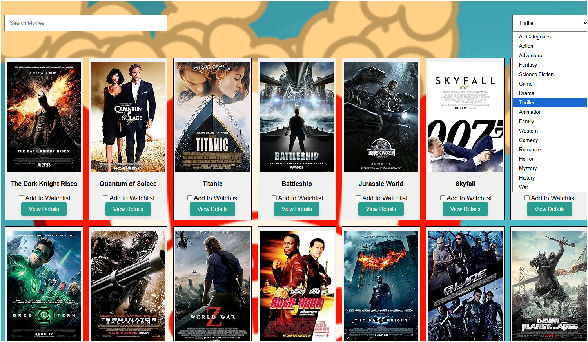
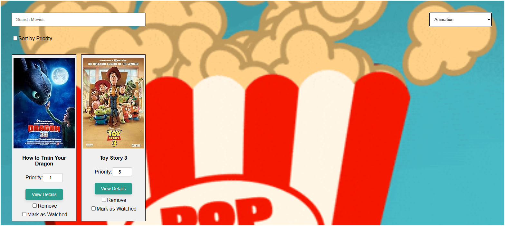
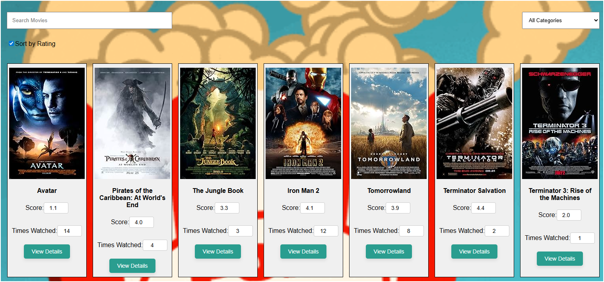

# Movie Catalogue Web Application

This project is a React single-page application (SPA) that allows users to browse a movie catalogue, manage a personal watchlist, and track completed movies. The application connects to a REST API for authentication and movie data management.

---

## Features

- User authentication with API key (via login page)  
- Browse and search movies  
- View detailed information about each movie  
- Filter movies (e.g., by genre, studio, or rating)  
- Add movies to a "Plan-to-Watch" list  
- Update movie priorities  
- Mark movies as watched, add scores, and move them to "Completed"  
- Track re-watch counts  
- Remove movies from the planning list  
- Smooth navigation using React Router  

---

## Interfaces

### Login Page
  
Users can log in with a username and password. An API key is retrieved and stored globally with React Context.

### Movie Catalogue
  
Displays a list of movies with posters and titles. Includes search and filter functionality. Movies can be quickly added to the watchlist.

### Watchlist
  
Displays movies the user plans to watch, sorted by priority. Priorities can be updated, and movies can be marked as watched.

### Completed Movies
  
Shows finished movies with score and date watched. Users can update re-watch counts and sort the list by score or date.

---

## Deployment

- Built with React and Vite  
- Uses a REST API for authentication and data  
- Deployed on a live server 